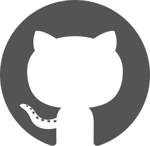

[Comment: Header]: #

# *Hi I'm Duvan Cardozo*

[![Logo_Github]][Url_Git]
[![Logo_Gmail]][Url_Gmail]
[![Logo_Linkedin]][Url_Linkedin]
[![Logo_whatsapp]][Url_whatsapp]

Soy Ingeniero y Tecnólogo en Software con mas de 5 años de experiencia como desarrollador Full Stack, participando en todo el ciclo de vida del software, desde el análisis y diseño hasta la implementación y el mantenimiento.
He liderado proyectos de desarrollo de software, gestionando equipos y asegurando la entrega de soluciones eficientes y escalables.

  <h1 align="center"></h1>

  

    

      
      ABOUT
    

    <h4 align="center">
      Software Engineer - Full Stack Developer |
      [Personal Web](https://duvan-cardozo.vercel.app)
    </h4>
  

---

  

    
    SKILLS
  

  

- **Languages**:

  
   
  
  
  

- **Full Stack Development**:

  
  
  
  

  
  
  
  
  

  
  
  

  

---

  

      
      GIT HUB STATS
  

  

    

      <picture>
        <source
          srcset="https://github-readme-stats-eight-theta.vercel.app/api/top-langs/?username=duvancardozo18&layout=compact&langs_count=8&theme=gotham&hide_border=true"
          media="(prefers-color-scheme: dark)"
        />
        <source
          srcset="https://github-readme-stats-eight-theta.vercel.app/api/top-langs/?username=duvancardozo18&layout=compact&langs_count=8&theme=graywhite&hide_border=false"
          media="(prefers-color-scheme: light), (prefers-color-scheme: no-preference)"
        />
        
      </picture>
    

    

      <picture>
        <source
          srcset="https://github-readme-stats-eight-theta.vercel.app/api?username=duvancardozo18&show_icons=true&theme=gotham&hide_border=true&include_all_commits=true&count_private=true"
          media="(prefers-color-scheme: dark)"
        />
        <source
          srcset="https://github-readme-stats-eight-theta.vercel.app/api?username=duvancardozo18&show_icons=true&theme=graywhite&hide_border=false&include_all_commits=true&count_private=true"
          media="(prefers-color-scheme: light), (prefers-color-scheme: no-preference)"
        />
        
      </picture>
    

  

---

  

      
      CONTRIBUTIONS
  

  

    
- [AudiosPlay](https://audiosplay.com/)
- [ArrozIA - Frontend](https://github.com/duvancardozo18/ArrozIA-frontend-web)
- [ArrozIA - Backend](https://github.com/duvancardozo18/ArrozIA-backend)

  

---

  

    
    CONTACT
  

  

    

      
      
      
    

  

---
[Comment: Logo]: #

[Logo_Github]: https://img.shields.io/badge/-Github-000?style=flat&logo=Github&logoColor=white
[Logo_Gmail]: https://img.shields.io/badge/-duvanestivencardozo@gmail.com-000?style=flat-square&logo=gmail
[Logo_Linkedin]: https://img.shields.io/badge/-Linkedin-000?style=flat-square&logo=linkedin
[Logo_stackoverflow]: https://img.shields.io/badge/-StackOverflow-000?style=flat-square&logo=stackoverflow
[Logo_whatsapp]: https://img.shields.io/badge/-WhatsApp-000?style=flat-square&logo=whatsapp

[Comment: Url]: #

[Url_Git]: https://github.com/duvancardozo18
[Url_Gmail]: mailto:duvanestivencardozo"gmail.com
[Url_Linkedin]: https://www.linkedin.com/in/duban-estiben-cardozo-osorio-04a0a5240/
[Url_whatsapp]: https://wa.me/573224671853
